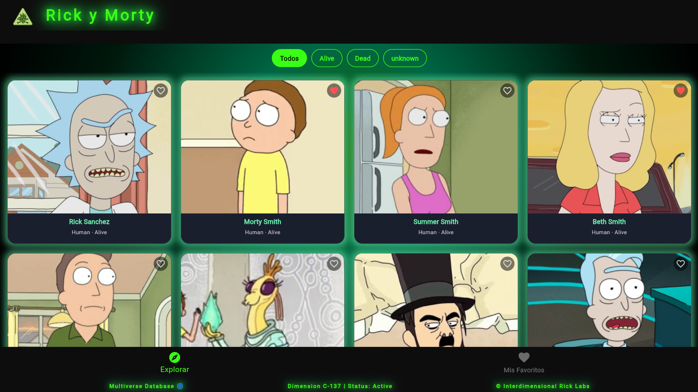

# 🛸 Rick y Morty App

Aplicación Flutter que consume la API pública de Rick and Morty, permite explorar personajes, filtrarlos por estado y guardar favoritos con persistencia.

---

## 🚀 Tecnologías

- Flutter
- Provider (estado global)
- SharedPreferences (persistencia)
- Rick and Morty API

---

## 📁 Estructura del proyecto

```
lib/
├── main.dart
├── models/
│   └── personaje.dart
├── services/
│   └── api_service.dart
├── provider/
│   └── character_provider.dart
├── screens/
│   └── personajes_page.dart
└── widgets/
    └── personaje_card.dart
```

---

## ⚙️ Instalación

1. Clona el repositorio
2. Instala las dependencias:

```bash
   flutter pub get
```

3. Corre la app:

```bash
   flutter run
```

---

## 📸 Captura de pantalla



---

## 🌿 Estrategia de ramas

- `main` — producción, nunca se toca directamente
- `develop` — integración de todo el trabajo
- `feature/api` — consumo de la API
- `feature/provider` — estado global
- `feature/ui` — interfaz de usuario
